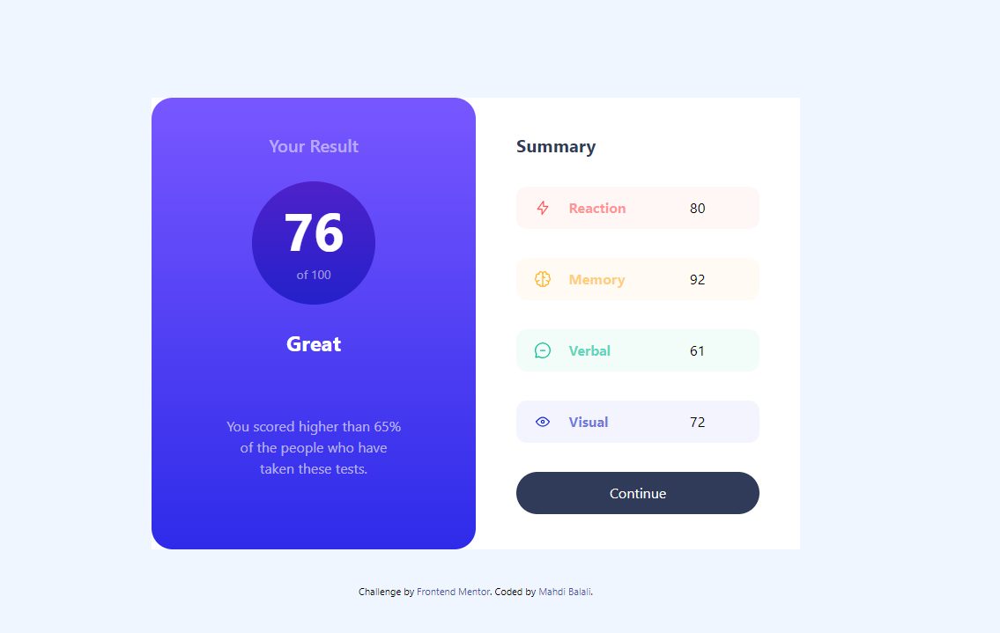
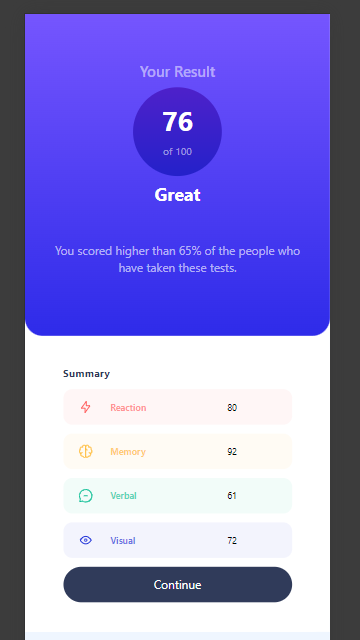

# Frontend Mentor - Results summary component solution

This is a solution to the [Results summary component challenge on Frontend Mentor](https://www.frontendmentor.io/challenges/results-summary-component-CE_K6s0maV). Frontend Mentor challenges help you improve your coding skills by building realistic projects. 

## Table of contents

- [Frontend Mentor - Results summary component solution](#frontend-mentor---results-summary-component-solution)
  - [Table of contents](#table-of-contents)
  - [Overview](#overview)
    - [The challenge](#the-challenge)
    - [Screenshot](#screenshot)
    - [Links](#links)
  - [My process](#my-process)
    - [Built with](#built-with)
    - [What I learned](#what-i-learned)
    - [Continued development](#continued-development)
    - [Useful resources](#useful-resources)
  - [Author](#author)
  - [Acknowledgments](#acknowledgments)

**Note: Delete this note and update the table of contents based on what sections you keep.**

## Overview

### The challenge

Users should be able to:

- View the optimal layout for the interface depending on their device's screen size
- See hover and focus states for all interactive elements on the page
- **Bonus**: Use the local JSON data to dynamically populate the content

### Screenshot

### Links

- Solution URL: [Github adr. of the files](https://github.com/mbalali63/results-summary-component-main.git)
- Live Site URL: [Page link at CloudFare](https://results-summary-component-main-43f.pages.dev/)

## My process

### Built with

As before, I used Tailwind-css framework to do this challenge. The most sophisticated part of the challenge was responsive design. It took me a long time 
to make it. Altough it is not completely the same, but it looks good now. so I publish it and will learn much more about responsive design, especially with Tailwind-CSS.

- Semantic HTML5 markup
- CSS custom properties
- Flexbox
- Tailwind CSS

### What I learned

During this project I learned to use Just-in-Time compiler of Tailwind-css. So, the proper values beyoned those included in tailwind-css defualts, could be used. It was a great and valueable experience for me to work with responsive design possiblities of tailwind. But I need more to practice. I am not good enough, yet.

### Continued development

As mentioned above I have to learn more about responsive desing, especialy with tailwind-css. During this project I just read a bit about design methods, such as Golden-ratio or the rule of thirds. It was so intresting and I have to read and do more about them.

### Useful resources

- [Online Pixel Ruler](https://www.rapidtables.com/web/tools/pixel-ruler.html) - I found this site so helpful while measuring different dimensions of the elements in this project. 
- [Tailwind-CSS Official website](https://tailwindcss.com/) - Official website of tailwind, is the most used reference during projects.

## Author

- Website - [My LinkedIn](www.linkedin.com/in/coding-geek-582a58263)
- Frontend Mentor - [@mbalali63](https://www.frontendmentor.io/profile/mbalali63)
- Twitter - [@codinggeek1984](https://www.twitter.com/codinggeek1984)

## Acknowledgments

I must thank Frontend Mentor for the great idea that help me grow in this field.

